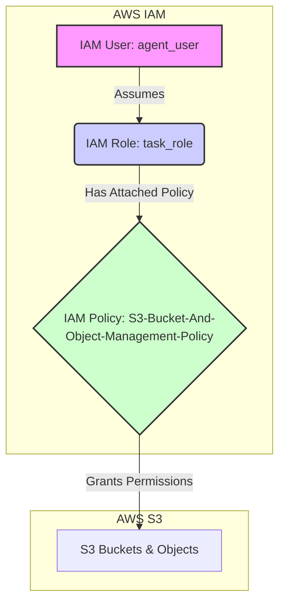

# Custom IAM User and Role Project
Project is implemented together with gemini cli in one afternoon to try out
agentic coding for real use case. 

Resources choosen are IAM user, role and managed policy, which are free of
cost and no possible damage (remember to teardown!!!)

The use case is to create a `IAM user` that can only assume a certain `role` with limited
permissions. Hereafter, this user is intended for use with agentic
infrastructure development purpose. The constrained role should ideally
limit any damages should the agent start to hallucinate and do stupid things. 
So choose your role permission carefully.

## 1. Overview

This project provides a set of scripts and CloudFormation templates to create a secure and repeatable IAM infrastructure on AWS. The core components are an IAM user (`agent_user`) and an IAM role (`task_role`). The user is granted permission to assume the role, which in turn has a policy attached that allows for the management of S3 buckets and objects.

The entire process is automated through shell scripts, and the infrastructure is defined as code using AWS CloudFormation, ensuring consistency and reliability across different environments.

## 2. For the DevOps Architect

### 2.1. Architecture Diagram

The following diagram illustrates the high-level architecture of the IAM components and their relationships:



### 2.2. Component Dependencies

-   **IAM User (`agent_user`):** This is the primary entity that authenticates with AWS. It does not have direct permissions to access resources. Its only permission is to assume the `task_role`.
-   **IAM Role (`task_role`):** This role contains the permissions required to perform tasks. It has a trust relationship with the `agent_user`, allowing the user to assume it.
-   **IAM Policy (`S3-Bucket-And-Object-Management-Policy`):** This managed policy is attached to the `task_role`. It defines the specific permissions for interacting with S3, such as creating buckets and managing objects.

### 2.3. Data Flow

1.  The `agent_user` authenticates with AWS using its access key and secret key.
2.  The user then makes an `sts:AssumeRole` call to assume the `task_role`.
3.  AWS STS returns a set of temporary security credentials (access key, secret key, and session token).
4.  The user then uses these temporary credentials to make API calls to S3.
5.  The S3 service checks the permissions of the `task_role` (via the attached policy) to authorize the requested actions.

## 3. For the Operator

### 3.1. Prerequisites

Before running any scripts, ensure you have the following:

-   AWS CLI installed and configured with an `admin` profile that has permissions to create IAM resources and CloudFormation stacks.
-   `jq` installed on your system.

If these are not installed, you can run the `setup.sh` script:

```bash
./scripts/setup.sh
```

### 3.2. Configuration

All configuration is managed in the `config/app.conf` file. You can modify this file to change the AWS profile, region, stack names, and resource names.

### 3.3. Deployment

To deploy the entire infrastructure, run the `deploy.sh` script:

```bash
./scripts/deploy.sh
```

This will create two CloudFormation stacks: one for the IAM policy and one for the IAM user and role.

### 3.4. Verification

After deployment, you can verify that all resources have been created correctly by running the `verify.sh` script:

```bash
./scripts/verify.sh
```

### 3.5. Teardown

To completely remove all resources created by this project, run the `teardown.sh` script:

```bash
./scripts/teardown.sh
```

This will delete the CloudFormation stacks and verify that the resources have been removed.

## 4. For the Automation Engineer

### 4.1. File Structure

```
.
├── config/
│   └── app.conf
├── cloudformation/
│   ├── iam_policy.yaml
│   └── iam_role_user.yaml
├── scripts/
│   ├── deploy.sh
│   ├── verify.sh
│   ├── teardown.sh
│   └── setup.sh
├── docs/
├── input/
├── output/
├── logs/
└── tests/
    └── unit/
```

### 4.2. Scripts

-   **`scripts/setup.sh`:** Prepares the local environment by creating directories and installing dependencies (AWS CLI, jq, cfn-lint).
-   **`scripts/deploy.sh`:** Orchestrates the deployment of the CloudFormation stacks. It reads configuration from `config/app.conf`, deploys the policy stack first, retrieves the policy ARN, and then deploys the user/role stack with the policy ARN as a parameter.
-   **`scripts/verify.sh`:** Verifies the state of the resources. It can be run in two modes:
    -   `deploy` (default): Checks that the user, role, and policy exist and are correctly configured.
    -   `teardown`: Checks that the user and role do not exist.
-   **`scripts/teardown.sh`:** Deletes the CloudFormation stacks in the reverse order of deployment and then runs `verify.sh teardown` to confirm the resources have been removed.

### 4.3. CloudFormation Templates

-   **`cloudformation/iam_policy.yaml`:** Defines a reusable `AWS::IAM::ManagedPolicy`. The policy name is parameterized.
-   **`cloudformation/iam_role_user.yaml`:** Defines the `AWS::IAM::User` and `AWS::IAM::Role`. It takes the ARN of the managed policy as a parameter to attach it to the role. It also creates an `AWS::IAM::AccessKey` for the user and outputs the credentials.

### 4.4. Logging and Debugging

-   All scripts log their output to the `logs/` directory. Each script run generates a new log file with a timestamp.
-   If a CloudFormation stack fails to deploy or delete, the scripts will output the relevant error messages and stack events to the log file to aid in debugging.
